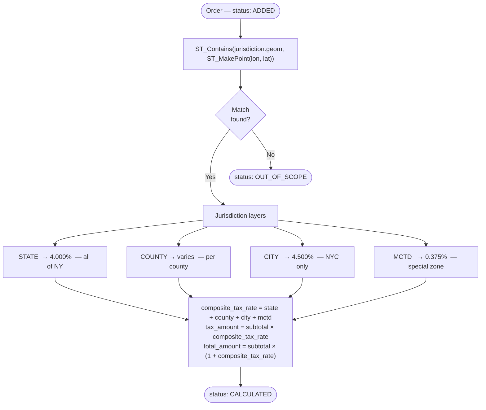

# Instant Wellness Tax Engine

## Overview

**Live:** [delion.digital](https://delion.digital)

TODO

---

## Business Logic

### Authentication

JWT-based auth with two tokens:

- **Access token** — short-lived (1h), sent in `Authorization: Bearer <token>` header on every request.
- **Refresh token** — long-lived (7d), stored in an `HttpOnly` cookie. Used to issue a new access token via `POST /api/v1/auth/refresh` without re-login.

On logout the refresh token is invalidated server-side and the cookie is cleared.

---

### Manual Order Creation & CSV Import

**Manual creation** — `POST /api/v1/orders`

Send a single order with `latitude`, `longitude`, `timestamp`, `subtotal`. Tax is calculated synchronously before the response is returned.

**CSV Import** — `POST /api/v1/orders/import`

Upload a `.csv` file with columns: `id, latitude, longitude, timestamp, subtotal`.

- Each row is validated (coordinate range, positive subtotal, parseable timestamp).
- Invalid rows are collected as errors and skipped; valid rows are bulk-inserted.
- Duplicate `id` handling is configurable: `skip` / `overwrite` / `fail`.
- Tax calculation runs asynchronously in the background after import.
- Progress is streamed in real time via SSE: `GET /api/v1/orders/imports/{trackingId}/progress`.
- Error report (CSV) can be downloaded: `GET /api/v1/orders/imports/{batchId}/errors`.

---

### Tax Calculation & Location Detection

Tax calculation uses **PostGIS point-in-polygon** lookup against pre-loaded NY jurisdiction boundaries.

**Flow:**



1. For each order with `status = ADDED`, a PostGIS query does `ST_Contains(jurisdiction.geom, ST_MakePoint(lon, lat))`.
2. The order is matched against three jurisdiction layers: **State → County → City**, plus **MCTD** (Metropolitan Commuter Transportation District) as a special rate.
3. The applicable rates are fetched from the `tax_rates` table and summed:

```
composite_tax_rate = state_rate + county_rate + city_rate + special_rates_sum
tax_amount         = subtotal × composite_tax_rate
total_amount       = subtotal × (1 + composite_tax_rate)
```

4. If the point falls outside all NY jurisdictions → `status = OUT_OF_SCOPE`.
5. If calculation succeeds → `status = CALCULATED`.

Processing is batched (1 000 orders per batch) so large imports don't block resources.

**NY tax rates (Publication 718, 2024):**

| Layer   | Rate      | Applied to               |
|---------|-----------|--------------------------|
| State   | 4.000%    | All of NY                |
| County  | 3.0–4.75% | Varies by county         |
| City    | 4.500%    | New York City (5 boroughs) |
| MCTD    | 0.375%    | Metro Commuter District  |

**Example — Manhattan order:**
`4.0% + 0.0% (county) + 4.5% (city) + 0.375% (MCTD) = 8.875%`

---

## How to Run Locally

> **Want to skip setup?** The app is already deployed at [delion.digital](https://delion.digital).

### Prerequisites

The app requires **PostgreSQL with the PostGIS extension**. Either use an existing instance or spin up a container:

```bash
docker run -d \
  --name taxengine-db \
  -e POSTGRES_DB=taxengine \
  -e POSTGRES_USER=postgres \
  -e POSTGRES_PASSWORD=postgres \
  -p 5432:5432 \
  postgis/postgis:16-3.4
```

### Run

Create a `.env` file in the project root:

```env
DB_URL=jdbc:postgresql://localhost:5432/taxengine?reWriteBatchedInserts=true
DB_USERNAME=postgres
DB_PASSWORD=postgres
JWT_SECRET_KEY=5367566B59703373367639792F423F4528482B4D6251655468576D5A71347437
NEXT_PUBLIC_API_BASE_URL=http://localhost:8080
NEXT_PUBLIC_MAPBOX_TOKEN=your_mapbox_token
APP_BASE_URL=http://localhost:8080
```

Then:

```bash
docker compose up --build
```

The backend starts on `http://localhost:8080`. Swagger UI: `http://localhost:8080/swagger-ui.html`.

On first startup the app automatically runs Liquibase migrations, loads NY geo boundaries, seeds tax rates, and inserts ~15 000 synthetic orders.

---

## DevOps Infrastructure

Live at **[delion.digital](https://delion.digital)**.

- **Cloud:** AWS EC2 (app) + AWS RDS (managed PostgreSQL + PostGIS)
- **Reverse proxy:** Nginx with SSL/TLS termination
- **CI/CD:** Automated pipeline — on push to `main` the app is built, containerized, and deployed to EC2

---

## Frontend

TODO

---

## Backend

```
server/src/main/java/com/example/server/
├── config/
│   ├── GeoDataLoader.java          # Loads NY county GeoJSON into PostGIS on startup
│   ├── TaxRateSeeder.java          # Seeds tax rates from NY Publication 718
│   ├── OrderSeeder.java            # Seeds ~15k synthetic orders on first startup
│   ├── SecurityConfig.java
│   ├── AsyncConfig.java
│   └── SwaggerConfig.java
├── controller/
│   ├── AuthController.java         # POST /api/v1/auth/login|registration|refresh|logout
│   ├── OrderController.java        # GET|POST /api/v1/orders, POST /import, SSE /progress
│   ├── TaxController.java          # POST /api/v1/orders/calculate
│   └── UserController.java         # GET /api/v1/users/current
├── service/
│   ├── impl/
│   │   ├── AuthServiceImpl.java
│   │   ├── OrderServiceImpl.java   # Import pipeline, manual create, pagination/filtering
│   │   └── TaxCalculationServiceImpl.java
│   ├── CalculationTriggerService.java  # Async trigger after CSV import
│   ├── CalculationProgressStore.java   # SSE event store per trackingId
│   └── ImportBatchStore.java           # Stores per-batch validation errors
├── repository/
│   ├── OrderRepository.java            # JPA + Specification filtering
│   ├── OrderSpecification.java         # Dynamic filter builder
│   ├── TaxCalculationNativeRepository.java  # Bulk PostGIS UPDATE query
│   └── native_query/OrderNativeRepository.java  # Bulk INSERT, duplicate check
├── entity/
│   ├── Order.java
│   └── User.java
├── dto/
│   ├── order/                      # Request/response/CSV row DTOs
│   └── user/                       # Auth DTOs
├── enums/
│   └── OrderStatus.java            # ADDED | CALCULATED | OUT_OF_SCOPE | FAILED_VALIDATION | PROCESSING
└── security/
    └── JwtAuthenticationFilter.java
```

**Tech stack:** Java 21 · Spring Boot 3 · Spring Security · PostgreSQL 16 + PostGIS 3.4 · Liquibase · OpenAPI / Swagger
