# Instant Wellness Tax Engine

> 🚀 **Live Demo:** [delion.digital](https://delion.digital)

## 🎥 Project Demo
[[Watch the demo]](https://www.youtube.com/watch?v=Hzc9RpnPe84)
<a href="https://www.youtube.com/watch?v=Hzc9RpnPe84" about="_blank">
  
</a>

---

## 💡 The Business Problem & Our Solution

**The Scenario:** A new delivery startup, "Instant Wellness Kits", successfully launched drone deliveries across New York State. The service went viral, delivering wellness kits in 20–30 minutes to any coordinates. However, amidst the rapid growth, the company completely overlooked a critical detail: **taxation**. With only 48 hours remaining to comply with the tax service's demands, they desperately needed a system to accurately calculate the complex NY composite sales tax for every delivered order based solely on its geographic coordinates.

**Our Solution:** We built the **Instant Wellness Tax Engine**, a highly-performant, geocoding-based tax calculation system that automatically handles complex sales tax logic.

- **100% Accurate Geo-Taxation:** By leveraging **PostgreSQL + PostGIS**, we perform precise "point-in-polygon" lookups of delivery coordinates (`latitude`, `longitude`) against pre-loaded New York State geographical jurisdiction boundaries.
- **Scalable Processing:** Whether creating a single manual order or bulk importing thousands via CSV, the system efficiently matches locations to State, County, City, and special district (MCTD) tax layers, computing the exact `composite_tax_rate` and `tax_amount` instantly.
- **Seamless User Experience:** We provide a sleek Admin panel to manage orders, track asynchronous CSV import progress in real-time via SSE, and review detailed tax breakdowns per order.

---

## 🖥️ User Interface

### Orders List Dashboard page


### CSV Import page


### Manual Order Creation page


---

## 🚀 How to Run Locally

We've made local setup as simple as possible using Docker.

### Prerequisites

Ensure you have [Docker](https://docs.docker.com/get-docker/) and [Docker Compose](https://docs.docker.com/compose/install/) installed on your machine.
The application requires **PostgreSQL with the PostGIS extension**. You can either spin up a container using the command below or let `docker-compose` handle it automatically:

```bash
docker run -d \
  --name taxengine-db \
  -e POSTGRES_DB=taxengine \
  -e POSTGRES_USER=postgres \
  -e POSTGRES_PASSWORD=postgres \
  -p 5432:5432 \
  postgis/postgis:16-3.4
```

### Quick Start

1. **Set up Environment Variables:**
   Create a `.env` file in the project directory:

   ```env
   DB_URL=jdbc:postgresql://localhost:5432/taxengine?reWriteBatchedInserts=true
   DB_USERNAME=postgres
   DB_PASSWORD=postgres
   JWT_SECRET_KEY=5367566B59703373367639792F423F4528482B4D6251655468576D5A71347437
   NEXT_PUBLIC_API_BASE_URL=http://localhost:8080
   NEXT_PUBLIC_MAPBOX_TOKEN=your_mapbox_token
   APP_BASE_URL=http://localhost:8080
   ```

2. **Run with Docker Compose:**

   ```bash
   docker compose up --build
   ```

3. **Access the Application:**
   - **Backend API:** `http://localhost:8080`
   - **Swagger UI (API Docs):** `http://localhost:8080/swagger-ui.html`
   - **Frontend:** Make sure to check your client setup, typically running on `http://localhost:3000`.

> **Note:** On first startup, the application automatically runs Liquibase migrations, loads NY geographical boundaries, seeds tax rates, and inserts ~15,000 synthetic orders so you can immediately explore the data.

---

## ⚙️ Business Logic & Tax Calculation

### Tax Calculation & Location Detection

Tax calculation uses **PostGIS point-in-polygon** lookup against pre-loaded NY jurisdiction boundaries.

**Flow:**

```mermaid
flowchart TD
    A([Order — status: ADDED]) --> B["ST_Contains(jurisdiction.geom, ST_MakePoint(lon, lat))"]
    B --> C{Match\nfound?}
    C -- No --> D([status: OUT_OF_SCOPE])
    C -- Yes --> E[Jurisdiction layers]
    D ~~~ E

    E --> F["STATE  → 4.000%  — all of NY"]
    E --> G["COUNTY → varies  — per county"]
    E --> H["CITY   → 4.500%  — NYC only"]
    E --> I["MCTD   → 0.375%  — special zone"]

    F & G & H & I --> J["composite_tax_rate = state + county + city + mctd
tax_amount = subtotal × composite_tax_rate
total_amount = subtotal × (1 + composite_tax_rate)"]

    J --> K([status: CALCULATED])
```



1. For each order with `status = ADDED`, a PostGIS query does `ST_Contains(jurisdiction.geom, ST_MakePoint(lon, lat))`.
2. The order is matched against three jurisdiction layers: **State → County → City**, plus **MCTD** (Metropolitan Commuter Transportation District) as a special rate.
3. The applicable rates are fetched from the `tax_rates` table and summed:

```text
composite_tax_rate = state_rate + county_rate + city_rate + special_rates_sum
tax_amount         = subtotal × composite_tax_rate
total_amount       = subtotal × (1 + composite_tax_rate)
```

4. If the point falls outside all NY jurisdictions → `status = OUT_OF_SCOPE`.
5. If calculation succeeds → `status = CALCULATED`.

Processing is batched (1,000 orders per batch) so large imports don't block resources.

**NY tax rates (Publication 718, 2024):**

| Layer  | Rate      | Applied to                 |
| ------ | --------- | -------------------------- |
| State  | 4.000%    | All of NY                  |
| County | 3.0–4.75% | Varies by county           |
| City   | 4.500%    | New York City (5 boroughs) |
| MCTD   | 0.375%    | Metro Commuter District    |

**Example — Manhattan order:**
`4.0% + 0.0% (county) + 4.5% (city) + 0.375% (MCTD) = 8.875%`

---

### Manual Order Creation & CSV Import

**Manual creation** — `POST /api/v1/orders`

Send a single order with `latitude`, `longitude`, `timestamp`, `subtotal`. Tax is calculated synchronously before the response is returned.

**CSV Import** — `POST /api/v1/orders/import`

Upload a `.csv` file with columns: `id, latitude, longitude, timestamp, subtotal`.

- Each row is validated (coordinate range, positive subtotal, parseable timestamp).
- Invalid rows are collected as errors and skipped; valid rows are bulk-inserted.
- Duplicate `id` handling is configurable: `skip` / `overwrite` / `fail`.
- Tax calculation runs asynchronously in the background after import.
- Progress is streamed in real time via SSE: `GET /api/v1/orders/imports/{trackingId}/progress`.
- Error report (CSV) can be downloaded: `GET /api/v1/orders/imports/{batchId}/errors`.

---

### Authentication

JWT-based auth with two tokens:

- **Access token** — short-lived (1h), sent in `Authorization: Bearer <token>` header on every request.
- **Refresh token** — long-lived (7d), stored in an `HttpOnly` cookie. Used to issue a new access token via `POST /api/v1/auth/refresh` without re-login.

On logout, the refresh token is invalidated server-side and the cookie is cleared.

---

## ☁️ DevOps Infrastructure

Live at **[delion.digital](https://delion.digital)**.

- **Cloud:** AWS EC2 (app) + AWS RDS (managed PostgreSQL + PostGIS)
- **Reverse proxy:** Nginx with SSL/TLS termination
- **CI/CD:** Automated pipeline — on push to `main` the app is built, containerized, and deployed to EC2

---

## 🏗️ Project Structure

### Backend

```text
server/src/main/java/com/example/server/
├── config/         # System configurations (Security, CORS, Async setup)
├── controller/     # REST API & SSE endpoints handling incoming HTTP requests
├── service/        # Core business logic (Orders, Tax Calculation bounds & rules)
├── repository/     # Database operations (JPA, PostGIS native lookups)
├── entity/         # Database models/entities mapping
├── dto/            # Data Transfer Objects for API requests and responses
├── enums/          # Enumerations and Constants (e.g., Order statuses)
└── security/       # JWT Authentication filters and authorization handling
```

**Tech stack:** Java 21 · Spring Boot 3 · Spring Security · PostgreSQL 16 + PostGIS 3.4 · Liquibase · OpenAPI / Swagger

### Frontend

```text
client/src/
├── app/            # Next.js App Router (Pages, Layouts, Routing)
├── modules/        # Feature-sliced modules (Entities, Features, Widgets specific logic)
└── shared/         # Reusable UI components, hooks, utilities, and assets
```

**Tech stack:** Next.js 15 (App Router) · React 19 · TypeScript · Tailwind CSS v4 · shadcn/ui · React Query · Zustand